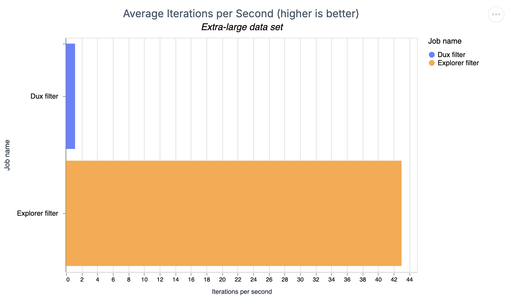
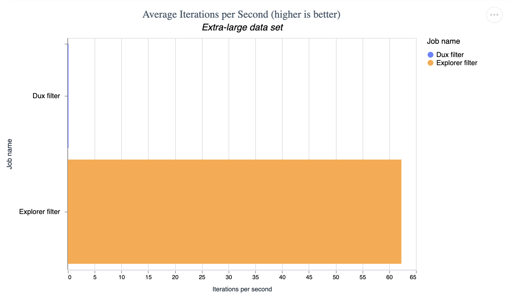
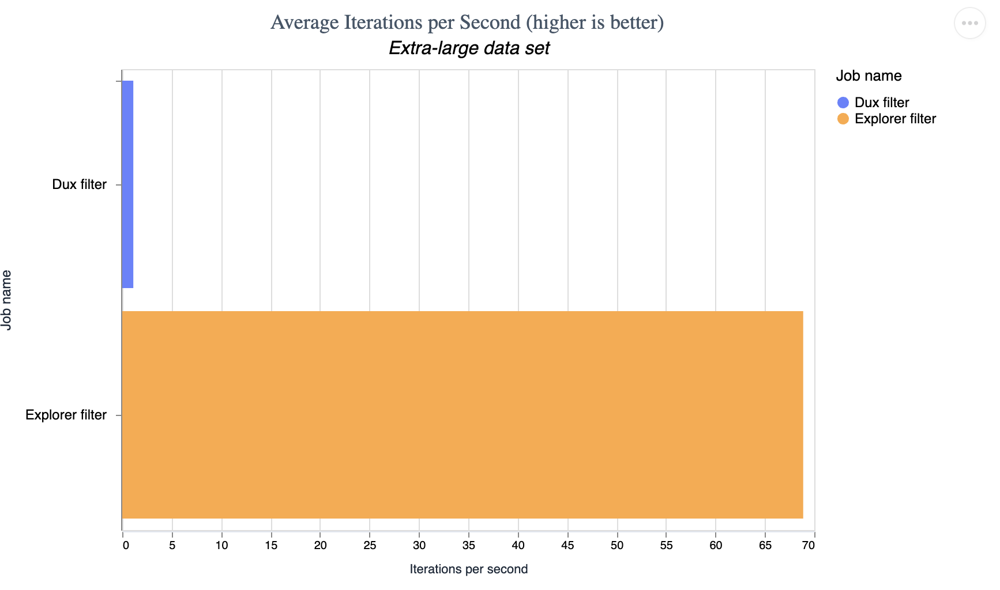
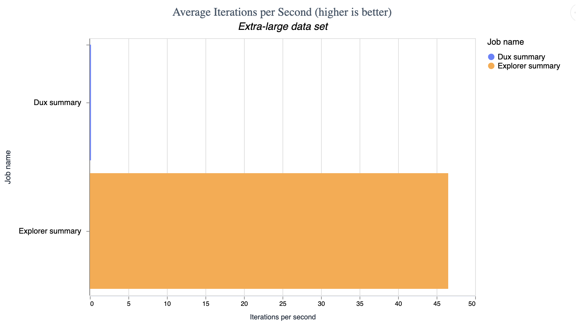

# Performance Comparison Between Dux and Explorer

## Loading data into Explorer and Dux

Generating Explorer DataFrame:

```
Generating Explorer DataFrames
Time to process 1000 entries: 0.541ms
Time to process 100000 entries: 75.697ms
Time to process 1000000 entries: 921.536ms
Time to process 10000000 entries: 8692.442ms
```

Generating Dux DataFrame:

```
Generating Dux
Time to process 1000 entries: 3.445ms
Time to process 100000 entries: 1293.172ms
Time to process 1000000 entries: 3531.815ms
Time to process 10000000 entries: 12902.952ms
```

## Filtering data

This test simply filters on 2 columns.

### Explorer Versus Dux lazy computing

```
Operating System: macOS
CPU Information: Apple M3 Max
Number of Available Cores: 14
Available memory: 36 GB
Elixir 1.19.3
Erlang 28
JIT enabled: true

Benchmark suite executing with the following configuration:
warmup: 2 s
time: 2 s
memory time: 2 s
reduction time: 0 ns
parallel: 1
inputs: Extra-large data set
Estimated total run time: 12 s
Excluding outliers: false

Benchmarking Dux filter with input Extra-large data set ...
Benchmarking Explorer filter with input Extra-large data set ...
Calculating statistics...
Formatting results...

##### With input Extra-large data set #####
Name                      ips        average  deviation         median         99th %
Explorer filter         42.69       0.0234 s    ±35.16%       0.0223 s       0.0385 s
Dux filter              0.117         8.53 s     ±0.00%         8.53 s         8.53 s

Comparison:
Explorer filter         42.69
Dux filter              0.117 - 364.30x slower +8.51 s

Memory usage statistics:

Name               Memory usage
Explorer filter      0.00001 GB
Dux filter              5.01 GB - 617413.52x memory usage +5.01 GB

**All measurements for memory usage were the same**
```


### Dux eager computing versus Explorer

```
Operating System: macOS
CPU Information: Apple M3 Max
Number of Available Cores: 14
Available memory: 36 GB
Elixir 1.19.3
Erlang 28
JIT enabled: true

Benchmark suite executing with the following configuration:
warmup: 2 s
time: 2 s
memory time: 2 s
reduction time: 0 ns
parallel: 1
inputs: Extra-large data set
Estimated total run time: 12 s
Excluding outliers: false

Benchmarking Dux filter with input Extra-large data set ...
Benchmarking Explorer filter with input Extra-large data set ...
Calculating statistics...
Formatting results...

##### With input Extra-large data set #####
Name                      ips        average  deviation         median         99th %
Explorer filter         43.00       23.25 ms    ±21.83%       23.49 ms       36.51 ms
Dux filter               1.15      871.03 ms     ±1.70%      878.11 ms      881.01 ms

Comparison:
Explorer filter         43.00
Dux filter               1.15 - 37.46x slower +847.78 ms

Memory usage statistics:

Name               Memory usage
Explorer filter      0.00832 MB
Dux filter             23.90 MB - 2873.92x memory usage +23.89 MB

**All measurements for memory usage were the same**
```



## Mutatinging data

This test mutates the data frame by creating a new column based off of two existing columns.

### Explorer Versus Dux lazy computing

```
Operating System: macOS
CPU Information: Apple M3 Max
Number of Available Cores: 14
Available memory: 36 GB
Elixir 1.19.3
Erlang 28
JIT enabled: true

Benchmark suite executing with the following configuration:
warmup: 2 s
time: 2 s
memory time: 2 s
reduction time: 0 ns
parallel: 1
inputs: Extra-large data set
Estimated total run time: 12 s
Excluding outliers: false

Benchmarking Dux mutation with input Extra-large data set ...
Benchmarking Explorer mutation with input Extra-large data set ...
Calculating statistics...
Formatting results...

##### With input Extra-large data set #####
Name                      ips        average  deviation         median         99th %
Explorer mutation         62.27       0.0161 s    ±62.79%       0.0138 s       0.0806 s
Dux mutation              0.116         8.59 s     ±0.00%         8.59 s         8.59 s

Comparison:
Explorer mutation         62.27
Dux mutation              0.116 - 534.78x slower +8.57 s

Memory usage statistics:

Name               Memory usage
Explorer mutation      0.00001 GB
Dux mutation              5.02 GB - 675602.98x memory usage +5.02 GB

**All measurements for memory usage were the same**
```



### Explorer Versus Dux eager computing

```
Operating System: macOS
CPU Information: Apple M3 Max
Number of Available Cores: 14
Available memory: 36 GB
Elixir 1.19.3
Erlang 28
JIT enabled: true

Benchmark suite executing with the following configuration:
warmup: 2 s
time: 2 s
memory time: 2 s
reduction time: 0 ns
parallel: 1
inputs: Extra-large data set
Estimated total run time: 12 s
Excluding outliers: false

Benchmarking Dux mutation with input Extra-large data set ...
Benchmarking Explorer mutation with input Extra-large data set ...
Calculating statistics...
Formatting results...

##### With input Extra-large data set #####
Name                      ips        average  deviation         median         99th %
Explorer mutation         68.88       14.52 ms    ±11.04%       14.62 ms       19.25 ms
Dux mutation               1.12      894.25 ms     ±1.15%      889.88 ms      905.95 ms

Comparison:
Explorer mutation         68.88
Dux mutation               1.12 - 61.59x slower +879.73 ms

Memory usage statistics:

Name               Memory usage
Explorer mutation      0.00761 MB
Dux mutation             28.44 MB - 3738.73x memory usage +28.43 MB

**All measurements for memory usage were the same**
```



## Summarizing data

This test groups and summarizes data from a dataset.

### Explorer Versus Dux lazy computing

```
Operating System: macOS
CPU Information: Apple M3 Max
Number of Available Cores: 14
Available memory: 36 GB
Elixir 1.19.3
Erlang 28
JIT enabled: true

Benchmark suite executing with the following configuration:
warmup: 2 s
time: 2 s
memory time: 2 s
reduction time: 0 ns
parallel: 1
inputs: Extra-large data set
Estimated total run time: 12 s
Excluding outliers: false

Benchmarking Dux summary with input Extra-large data set ...
Benchmarking Explorer summary with input Extra-large data set ...
Calculating statistics...
Formatting results...

##### With input Extra-large data set #####
Name                       ips        average  deviation         median         99th %
Explorer summary         46.50       0.0215 s    ±20.38%       0.0210 s       0.0571 s
Dux summary              0.138         7.26 s     ±0.00%         7.26 s         7.26 s

Comparison:
Explorer summary         46.50
Dux summary              0.138 - 337.63x slower +7.24 s

Memory usage statistics:

Name                Memory usage
Explorer summary      0.00001 GB
Dux summary              4.99 GB - 570568.41x memory usage +4.99 GB

**All measurements for memory usage were the same**
```



### Dux eager computing versus Explorer

```
Operating System: macOS
CPU Information: Apple M3 Max
Number of Available Cores: 14
Available memory: 36 GB
Elixir 1.19.3
Erlang 28
JIT enabled: true

Benchmark suite executing with the following configuration:
warmup: 2 s
time: 2 s
memory time: 2 s
reduction time: 0 ns
parallel: 1
inputs: Extra-large data set
Estimated total run time: 12 s
Excluding outliers: false

Benchmarking Dux summary with input Extra-large data set ...
Benchmarking Explorer summar with input Extra-large data set ...
Calculating statistics...
Formatting results...

##### With input Extra-large data set #####
Name                      ips        average  deviation         median         99th %
Explorer summar         50.63       19.75 ms     ±6.08%       19.82 ms       23.64 ms
Dux summary             32.38       30.89 ms     ±6.18%       30.38 ms       37.84 ms

Comparison:
Explorer summar         50.63
Dux summary             32.38 - 1.56x slower +11.14 ms

Memory usage statistics:

Name               Memory usage
Explorer summar         9.17 KB
Dux summary            43.41 KB - 4.73x memory usage +34.24 KB

**All measurements for memory usage were the same**
```


